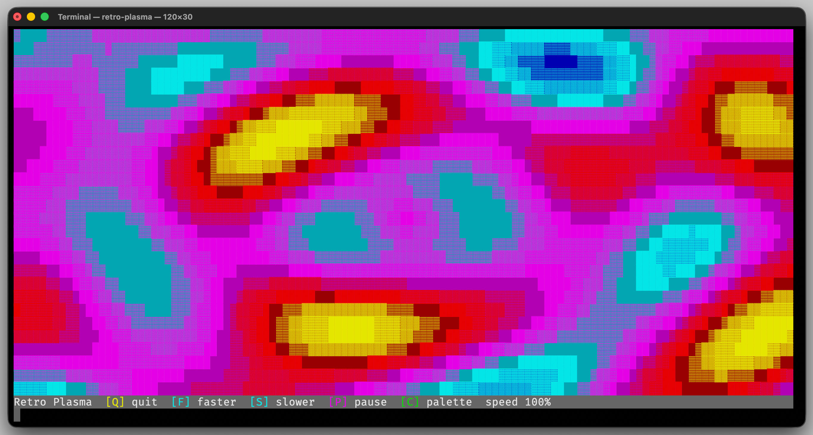

# Erbsland Color Terminal Library for C++

✔ Unicode-safe terminal layout  
✔ Cross-platform terminal abstraction  
✔ Clean C++20 API for colorful terminal output

The *Erbsland Color Terminal Library* is a small and focused **C++20 static library** for building rich terminal applications.

It provides reliable building blocks for **colorful terminal output**, **Unicode-aware text handling**, **key-based input**, and **2D geometry helpers** that simplify the development of terminal user interfaces, command-line tools, and terminal games.

The library is designed to be lightweight, expressive, and portable across **Linux, macOS, and Windows**.



# Features

- ANSI foreground and background colors with typed color parts and color sequences
- Correct handling of **zero-width and full-width Unicode characters**
- Terminal writing, screen handling, and platform-specific key input
- Unicode-aware terminal strings and **per-cell character buffers**
- Automatic terminal size detection with resize callbacks
- Geometry helpers for positions, sizes, rectangles, anchors, alignments, margins, and bitmaps
- Frame and rectangle drawing utilities
- Text wrapping and alignment helpers
- Bitmap font rendering for large terminal text
- Standalone unit tests for the extracted terminal and geometry modules
- Cross-platform support for **Linux, macOS, and Windows**

# Documentation

Full documentation, tutorials, and API reference are available here:

→ [https://color-term.erbsland.dev](https://color-term.erbsland.dev)

The documentation includes:

- Step-by-step tutorial
- Integration and usage guides
- Complete API reference
- Build and development instructions

# Installation

The recommended way to use the library is by including it directly in your CMake project.

Clone the repository and add it as a subdirectory:

```console
git clone https://github.com/erbsland-dev/erbsland-cpp-color-term.git
```

Then include it in your `CMakeLists.txt`.

# Quick Start

```cmake
cmake_minimum_required(VERSION 3.28)
project(ExampleProject)

add_subdirectory(erbsland-cpp-color-term)

add_executable(example src/main.cpp)
target_link_libraries(example PRIVATE erbsland-color-term)
```

Example program:

```cpp
#include <erbsland/cterm/Terminal.hpp>

using namespace erbsland::cterm;

auto main() -> int {
    auto terminal = Terminal{{80, 25}};
    terminal.initializeScreen();

    terminal.printLine(fg::BrightGreen, "Hello terminal.");

    terminal.restoreScreen();
    return 0;
}
```

# Building the Library

Configure and build the project with CMake:

```console
cmake -S . -B cmake-build-debug -G Ninja -DCMAKE_BUILD_TYPE=Debug
cmake --build cmake-build-debug
```

# Running the Unit Tests

The project includes standalone unit tests.

```console
ctest --test-dir cmake-build-debug --output-on-failure
```

# Requirements

- **C++20 compatible compiler**
- **CMake 3.28+**
- **Python 3** (used by the build tooling)

# License

Copyright (c) 2026 Tobias Erbsland  
https://erbsland.dev

Licensed under the **Apache License, Version 2.0**.
